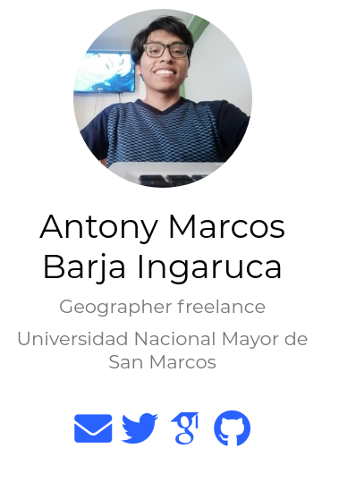
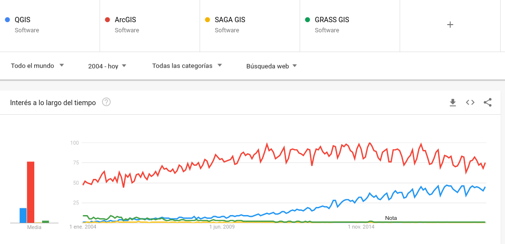
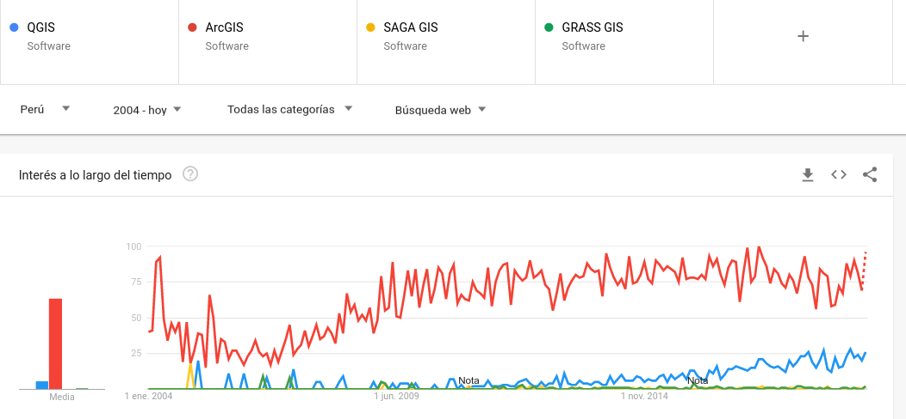
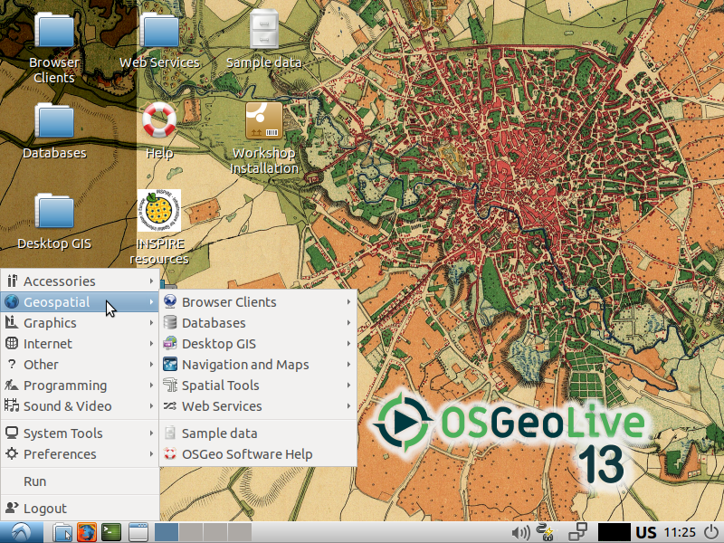
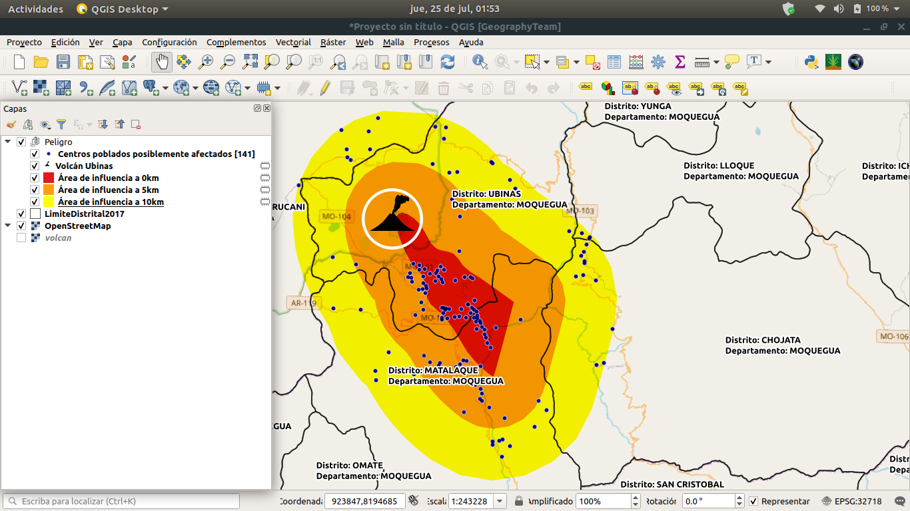
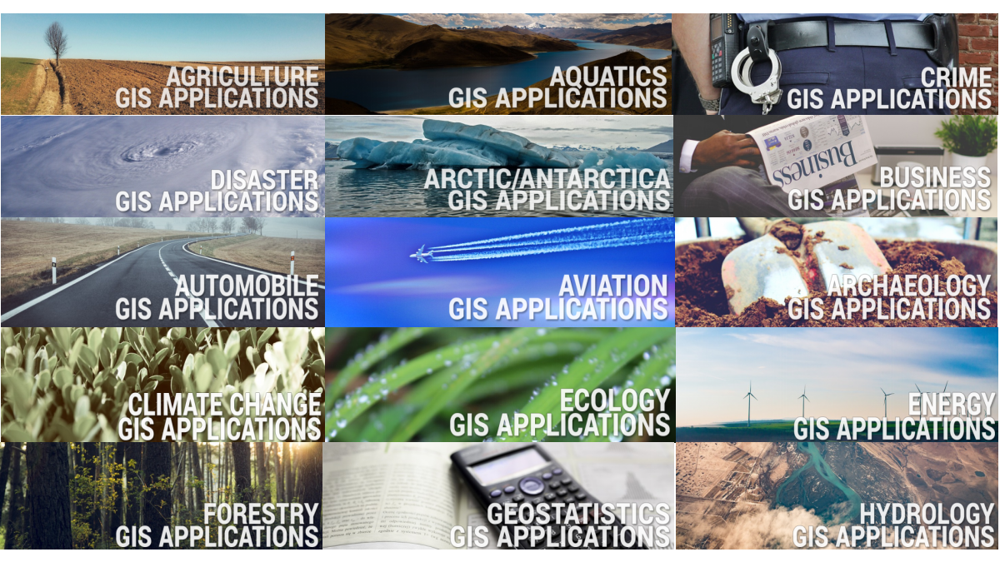
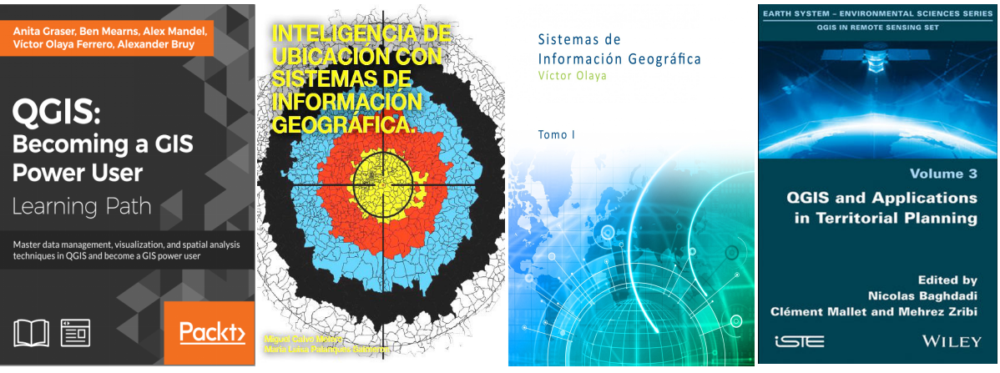
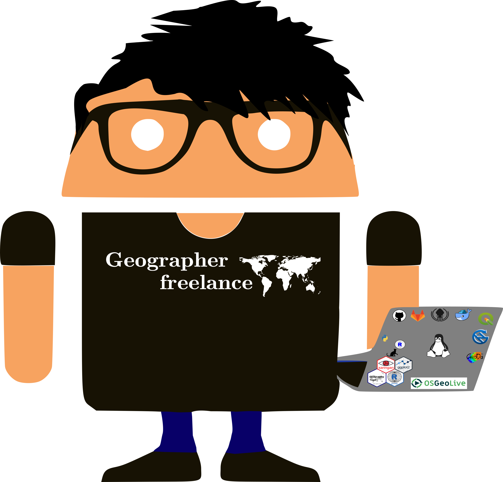

```{r setup, include=FALSE}
options(htmltools.dir.version = FALSE)
```

# Presentación
.pull-left[
```{r,echo=FALSE,fig.align='left',out.width=300,out.height=450}

```
##### [personal website](https://barja8.github.io/)
]
.pull-right[

* Analista de datos espaciales para la GRD en la **GERMAN RED CROSS** 

* He particiado en la elaboración de 3 planes de alerta temprana para los eventos del Fenómeno del Niño, Inundaciones en la Amazonía Peruana, **Heladas y Nevadas en la zona sur andina.**

* Grupo de investigación con la **University of Wisconsin-Madison**

* He participado en algunos proyectos de Minam como **Actualización del mapa de cobertura vegetal**

* He capacitado a **INIA** y **SERNAP**

* Elaborando cursos virtuales de **QGIS** y **R** en la empresa de Geomática Ambiental.  

]
---
# Tendencias 
A nivel mundial

```{r, echo=FALSE}

```
---
# Tendencias
En Perú ...

```{r, echo=FALSE}

```
  
---
# Temario
.pull-left[
### Introducción al manejo de datos espaciales con QGIS:
 
 * Aspectos Generales de los Sistemas de Información Geográfica 
 * Instalar OsGeoLive 13 - (**QGIS** + **SAGA** + **GRASS** + **OTB** + **R**)
 * QGIS y sus 20 mejores plugins
 * Fuentes de información geográfica abierta - Geographical data mining* 
 * Análisis espacial y geoprocesamiento con datos vectoriales y raster
 * **GRASS + QGIS** , **SAGA + QGIS**
 * Elaboración de mapas temáticos 
 * Integración **RQGIS**, **RSAGA**, **RGRASS**
 * **TRENDSEARTH (QGIS + GEE)**
 ]

.pull-rigth[

```{r,echo=FALSE,fig.align='right',out.height=400,out.width=500}

```

]
---
# Proyecto 
.pull-left[
### Aplicación de GIS: Tema libre
* Software principal QGIS u otros de que pertenecen al ecosistema de OsGEOlive
* Grupos de 2 o 3 personas
* Entrega del trabajo final en un **formato digital** 
* Entrega de **mapas temáticos ** en un formato **png** o pdf
* Entregada de todo los insumos utilizados en un formato de **Geopackages** o **Qconsolidate**
]

.pull-right[
```{r,echo=FALSE,fig.align='right'}

```

]

---
# Más de **1000** aplicaciones en GIS

```{r,echo=FALSE,out.height=450}

```

##### *Más información [aquí](https://gisgeography.com/gis-applications-uses/)*

---
# Evaluación
```{r,echo=FALSE, out.width=1200,out.height=520,fig.align='center'}


```

---
# Referencias bibliográficas
```{r,echo=FALSE}

```
---
background-color:cover
class:center
# GRACIAS!
<div>
 
<br/>
<br/>
<div>
 
<a href="https://github.com/barja8" >barja8.github</a>
 </div>

<div>
 
 <a href="https://twitter.com/AntonyBarja1">Antony.Barja</a>
 </div>

<div>
 
 <a href=mailto:"antony.barja8@gmail.com">antony.barja8</a>
 </div>

**Slides created via the R package** [**xaringan**](https://github.com/yihui/xaringan)

