```{r setup, include=FALSE}
options(htmltools.dir.version = FALSE)
```


background-size: cover
class: center, middle, inverse
# Aspectos generales de los Sistemas de Información Geográfica
---
# ¿Qué es un GIS o SIG?

.pull-left[
<br>
Es un sistema que integra tecnología informática, personas e información geográfica y cuya principal función es capturar, analizar, almacenar, editar y representar datos georreferenciados (**Olaya,2014**).
<br>
<br>
**Desde un perpectiva técnica**:
<br>
`Es un conjunto de herramientas que nos permite manipular, getionar y trabajar información georreferenciada.`

##### _Mas información_ [aquí](http://volaya.github.io/libro-sig/)
]

.pull-left[


]
<!-- class: inverse, center, middle -->
---
# Componentes de un SIG

```{r,echo=FALSE, out.width= 850 ,out.height= 520, fig.align='center'}
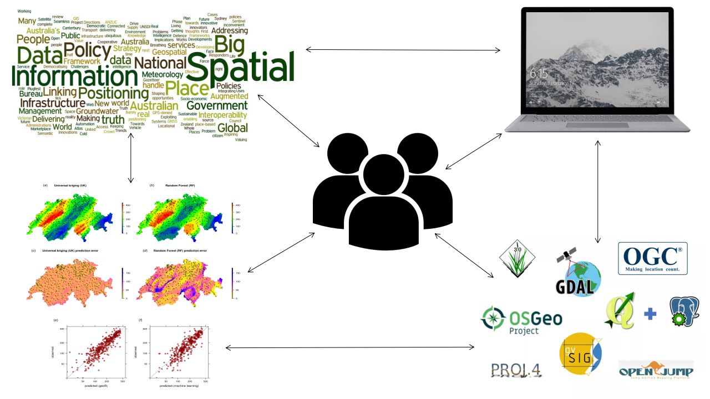
```

---
# Diferencia entre un SIG  y CAD 
<br>
--
.pull-left[
Sistema de Información Geográfica (**SIG**):
--
Diseña para reflejar la realidad, mayor peso a la **gestión de datos**

Diseño Asistido por Ordenador (**CAD**):
--
Diseña algo que no existe todavía, mayor peso a la **parte estética**

]

.pull-right[
```{r,echo=FALSE,out.width = "300px",fig.align='center'}
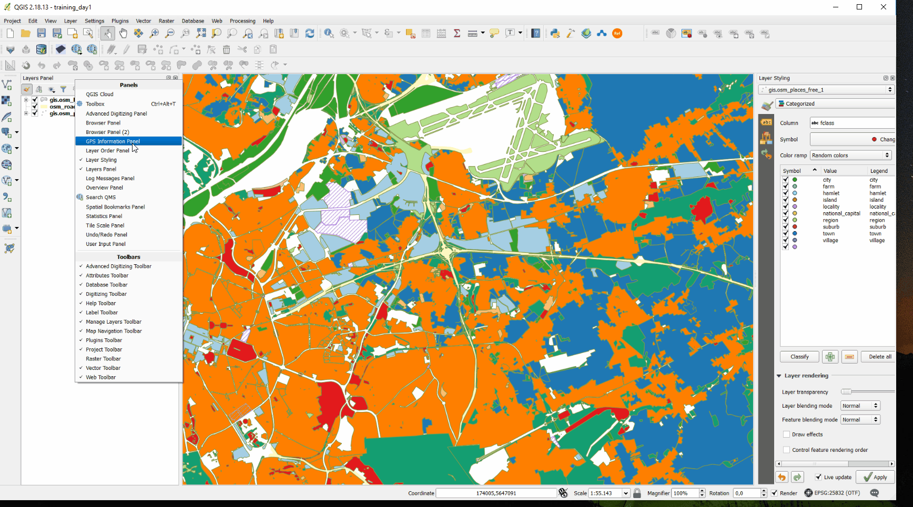
```
<br>
<br>
```{r,echo=FALSE,out.width = "300px",fig.align='center'}
knitr::include_graphics("img/cad.gif")
```
]
---
# Qué son los datos espaciales?
Son todos los datos que presentan un sistema de referencia de coordenadas (src).

```{r,echo=FALSE,out.width = "650px",fig.align='center'}
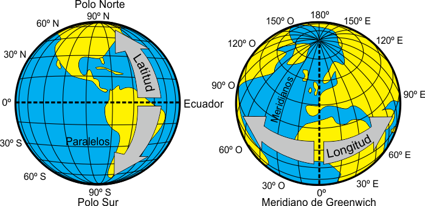
```

---
# Tipos de datos espaciales
<br>
--

Son todos los datos que presentan geolocalización, es decir presentan un SRC.
+ **Datos vectoriales**
+ **Datos raster**
--
<br>

```{r,echo=FALSE,fig.align='center', out.height=400}
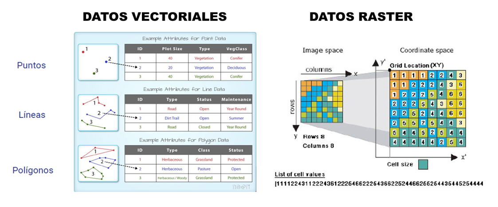
```

---
# Qué es un dato vectorial?
Son **formas geométricas** (punto, linea y poligonos) que representan a los elementos geográficos que existen en el territorio

```{r,echo=FALSE,fig.align='center', out.height=400}
knitr::include_graphics("img/vector.png")
```

---
# Qué es un dato raster?
Son **matrices de valores**, donde la unidad mínima es el pixel, y este contiene información geolocalizada de tipo continua.

```{r,echo=FALSE,fig.align='center', out.height=400}
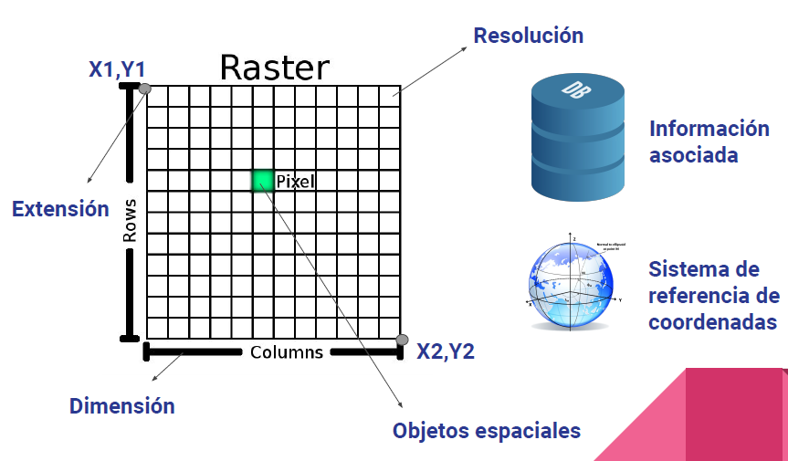
```

---
# Qué es un geoprocesamiento ? 
--
<br>
La palabra geoprocesamiento involucra varios aspectos cómo:
--
<br>
* Automatizar tareas de administración de datos: **Cortar**, **reproyectar**
--
<br>
* Modelar y análizar patrones espaciales
--
<br>
* Compartir flujos de trabajos
--
<br>
* Desarrollar sus propias herramientas
<br>
--
En conclusión:
--
<br>
##### **SON TODAS LAS OPERACIONES QUE SE REALIZAN CON DATOS GEOGRÁFICOS**.
.pull-down[
```{r,echo=FALSE,out.width = "350px",fig.align='center'}
knitr::include_graphics("img/geopro.gif")
```
]

##### _Mas información_ [aquí](http://desktop.arcgis.com/es/arcmap/10.3/main/analyze/what-is-geoprocessing.htm)

---
# Geoprocesamiento de datos vectoriales

```{r,echo=FALSE,fig.align='center',out.height=400}
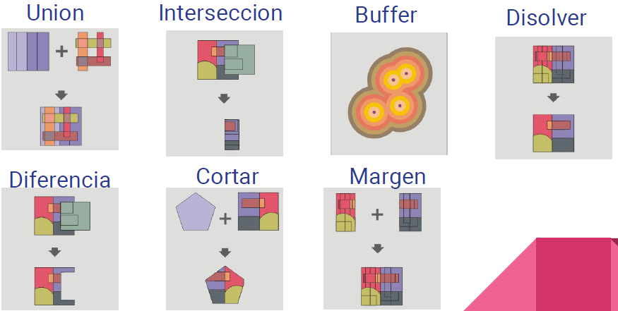
```


---
# Geoprocesamiento de datos raster

```{r,echo=FALSE,fig.align='center', out.height=400}
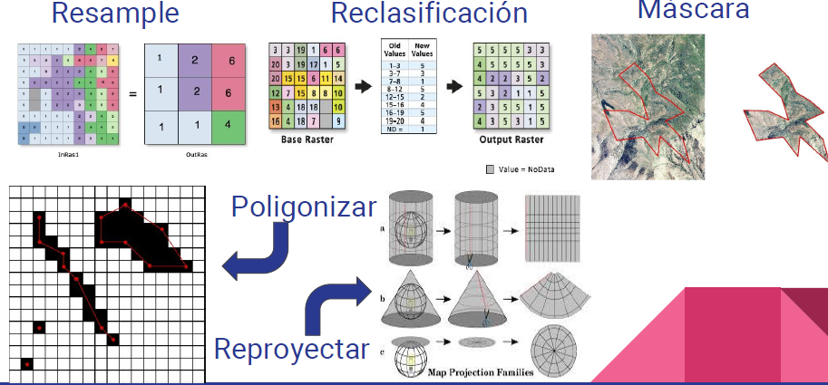
```
  
---
background-size: cover
class: center, middle, inverse
# Introducción a OSGEO - Fundación geoespacial de codigo abierto 
---
# ¿Qué es OSGEO?
.pull-left[
Open Source Geospatial Foundation, es una organización no gubernamental sin fines de lucro **cuya misión es apoyar y promover el desarrollo colaborativo de software, datos y educación geoespacial de código abierto**.

```{r,echo=FALSE}
knitr::include_graphics("img/osgeo.png")
```

##### _Mas información_ [aquí](https://www.osgeo.org/projects/)
]
<br>
--
.pull-right[
```{r,echo=FALSE,fig.align='center'}
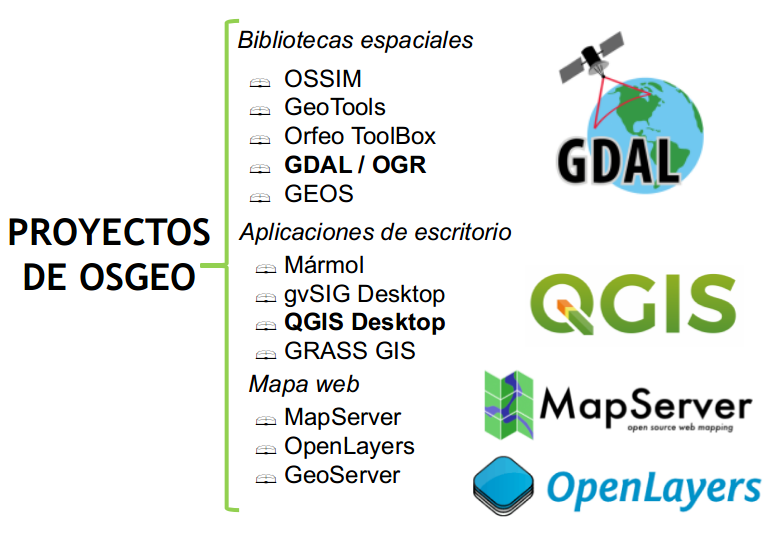
```
]

---
# Qué es FOSS4G?
.pull-left[
* FOSS4G:(Free Open Source and Software for Geoespatial)
<br>
<br>
* Es un evento que ofrece a todos los profesionales, estudiantes y profesores a reunirse y hablar sobre software gratuito y de código abierto para el almacenamiento, procesamiento y visualización de datos espaciales.
<br>
* La primera reunión fue en año 2006 Lausana (Suiza)
##### _Mas información_ [aquí](https://2019.foss4g.org/)
]

.pull-right[

<iframe width="560" height="315" src="https://www.youtube.com/embed/yndkgZlDcek" frameborder="0" allow="accelerometer; autoplay; encrypted-media; gyroscope; picture-in-picture" allowfullscreen></iframe>

]

---
# OSGEOLIVE

.pull-left[

Es una máquina virtual basada en **Lubuntu** , que le permite probar una **amplia variedad de software geoespacial de código abierto sin instalar nada**. Está compuesto completamente de software libre, lo que le permite distribuirse, duplicarse y distribuirse libremente.

##### _Mas información_ [aquí](https://live.osgeo.org/en/index.html)

]

.pull-right[

<iframe width="560" height="315" src="https://www.youtube.com/embed/aH-8MXkMoGc" frameborder="0" allow="accelerometer; autoplay; encrypted-media; gyroscope; picture-in-picture" allowfullscreen></iframe>

]
---
# Instalación de OsgeoLive
 
```{r,echo=FALSE,fig.align='center', out.height=480}
knitr::include_graphics('img/osgeolive.png')
```

---
# Qué es QGIS ?
Es un software libre y de código abierto que se ha convertido en un potente software SIG de escritorio que permite a los usuarios crear, editar, visualizar, analizar y publicar información geoespacial (www.qgis.org).
<br>
<br>
```{r,echo=FALSE,out.width = "660px",fig.align='center'}
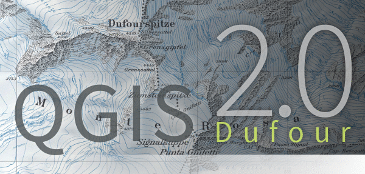
```
---
# Características de QGIS
--
<br>
* Interfaz gráfica amigable
--
<br>
* Corre en múltiples sistemas operativos (GNU/Linux, Unix, Mac OS, Microsoft Windows y Android)
--
<br>
* Soporta numerosos formatos de archivos y bases de datos, así como servicios web
--
<br>
* Integra de mejor manera otros software libres como SAGA, GRASS Y R, entre otros
--
<br>
* Presenta una comunidad académica y científica muy dinámica.

```{r,echo=FALSE,out.width = "660px",fig.align='center'}
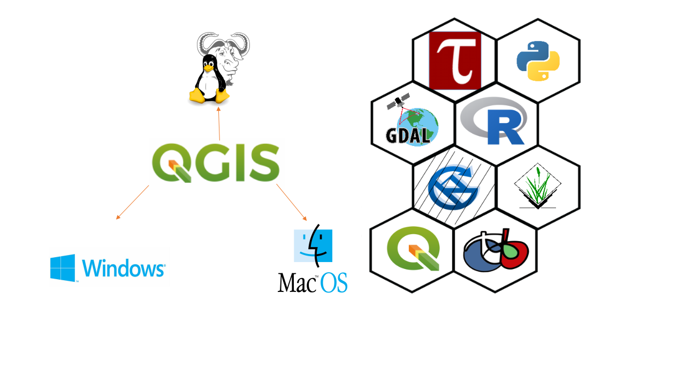
```

---
# Propina 🗺️

Actualmente, se lanza una nueva versión de QGIS cada cuatro meses; sin embargo QGIS ofrece la elegir entre diferentes versiones.
Entre ellas tenemos a la versión:
1. **LTR**:  LANZAMIENTO A LARGO PLAZO (Modificado 1 vez al año)
2. **LR**:  última versión (Modificado cada 4 meses)
3. **DEV**: Versión de prueba (Se modifica en meses, semanas o días)

```{r,echo=FALSE,out.width = "660px",fig.align='center'}
knitr::include_graphics('img/dev.png')
```

---
# Por qué usar QGIS?
.pull-top[
```{r,echo=FALSE,out.width=750,out.height=270,fig.align='center'}
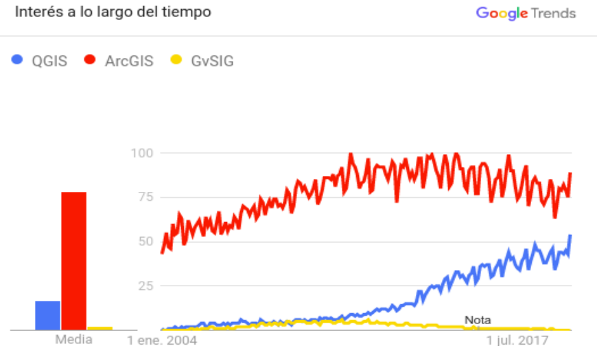
```
]

.pull-down[
```{r,echo=FALSE, out.width=750,out.height=270,fig.align='center'}
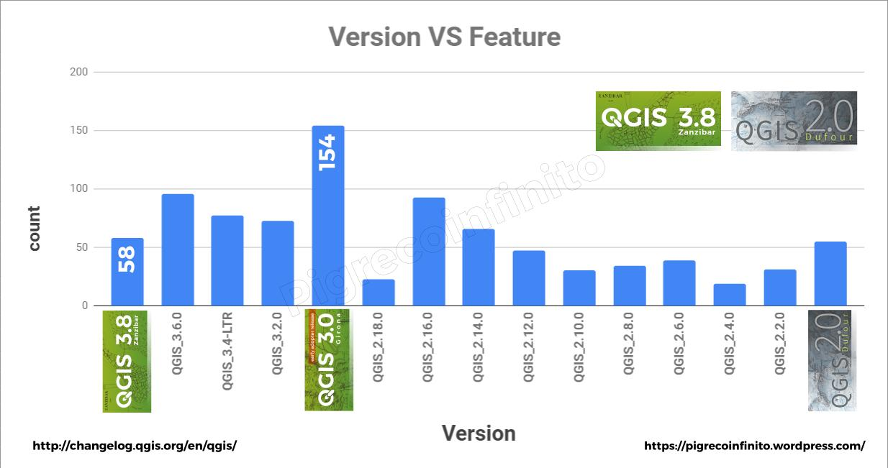
```
]

---
background-size: cover
class: center, middle, inverse

# Parte práctica 
---
# Descargando e instalando el software QGIS
La instalación **depende del sistema operativo (SO)**, para este ejemplo realizaremos el procedimiento de instalación para en el SO de Windows.

.pull-left[
<center>Instalador autónomo QGIS</center>
```{r,echo=FALSE, fig.align='center',out.width=450,out.height=400}
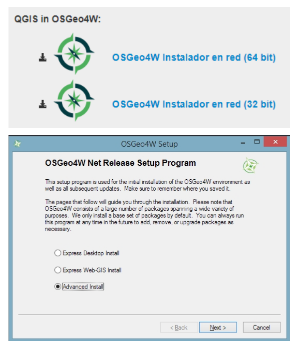
```
]

.pull-right[
<center>Instalador de red OSGeo4W</center>
```{r, echo=FALSE,fig.align='center',out.width=750,out.height=450}
knitr::include_graphics("img/insta02.png")
```
]

---
# Componentes de la Interfaz Gráfica de Usuario(**GUI**) de QGIS

```{r, echo=FALSE,out.width=970,out.height=500}
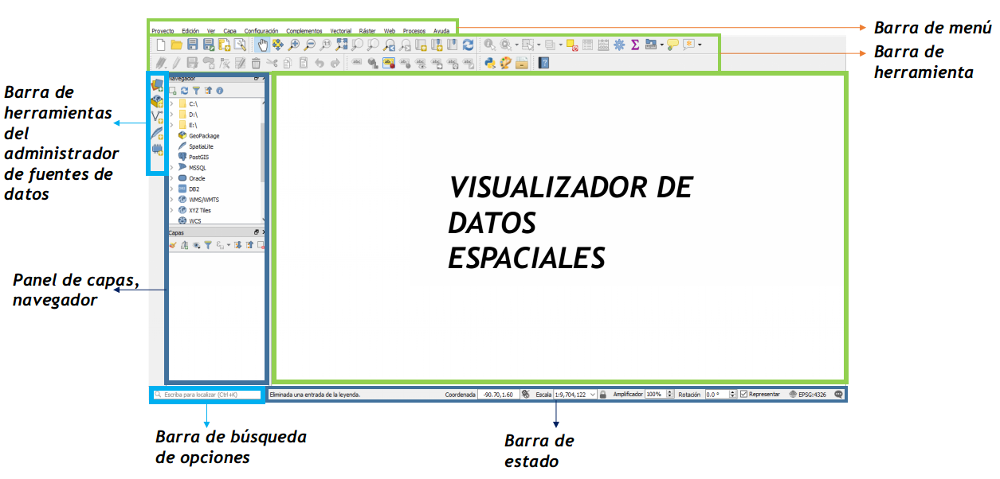
```

---
# Explorando los componentes que presenta la barra de menú

```{r, echo=FALSE,out.width=950,out.height=450,fig.align='center'}
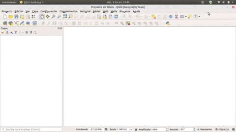
```

---
# Explorarando la caja de herramientas o toolbox de QGIS

```{r, echo=FALSE,out.width=950,out.height=450,fig.align='center'}
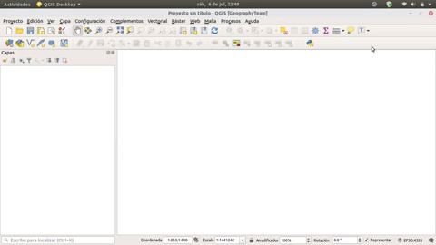
```

---
# ¿Qué son los plugins y para que sirve?

.pull-left[
Los plugins son herramientas o módulos adicionales que sirven para realizar tareas o geoprocesos que no están incluidos en el mismo programa principal de QGIS.
Los lenguajes de programación que son empleados por los usuarios para crear plugins de QGIS incluyen a los lenguajes de programación como C++ y **Python**.

```{r, echo=FALSE,out.width=400,out.height=200,fig.align='center'}
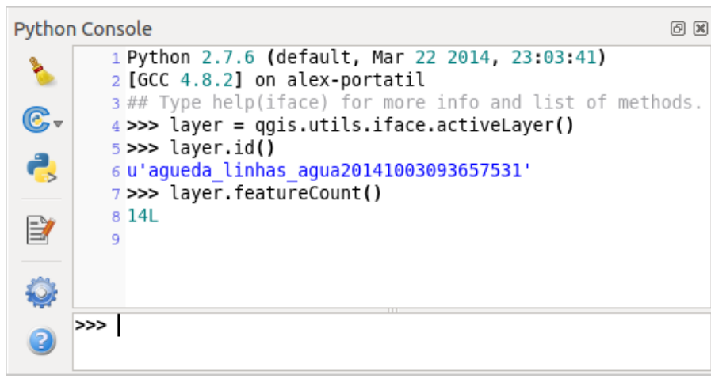
```

]

.pull-right[

```{r, echo=FALSE,out.width="400px",out.height="400",fig.align='center'}
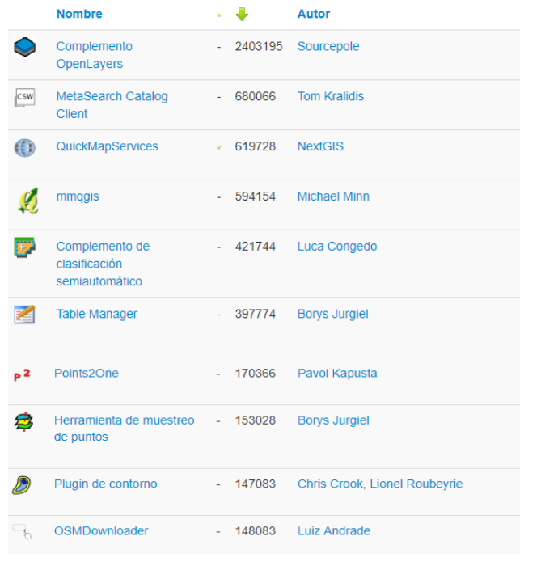
```

]

---
# Cómo instalar un plugin?  

```{r, echo=FALSE,out.width=950,out.height=450,fig.align='center'}
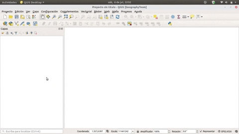
```

---
# Instalacion de plugin para personalizar **GUI**


.pull-left[

Load QSS es un plugin de QGIS que permite personalizar la apariencia de la interfaz gráfica a criterio del mismo usuario.
<br>

```{r, echo=FALSE,out.width="250px",out.height="150",fig.align='center'}
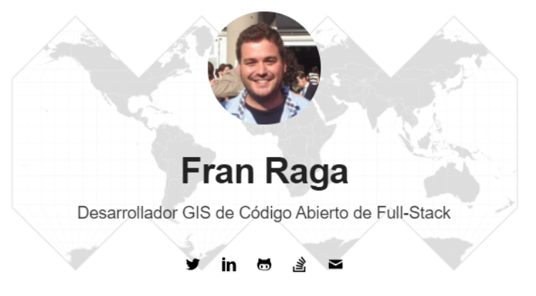
```
]

.pull-right[

```{r, echo=FALSE,out.width=700,out.height=250,fig.align='right'}
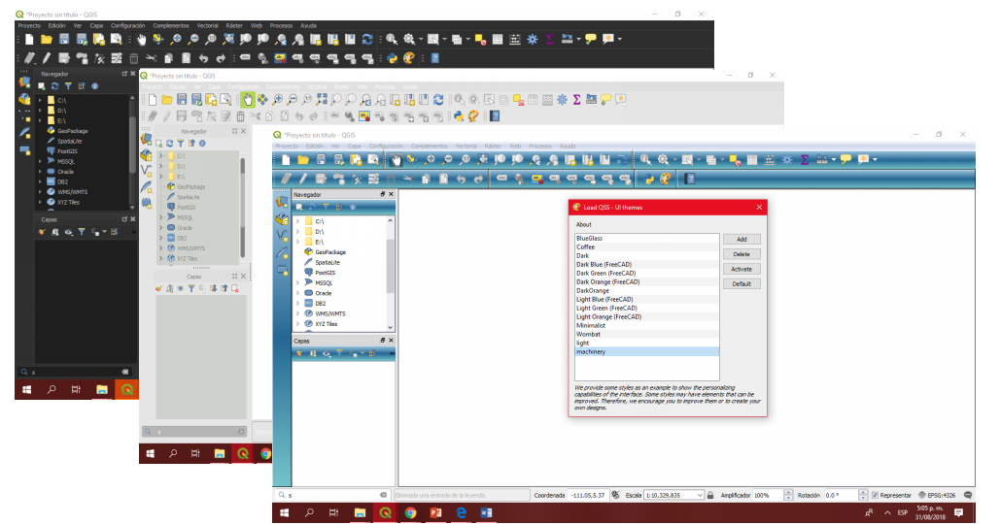
```
]
<br>
<br>
<br>
En las versiones últimas de **QGIS** como la 3.4 y 3.8 presentan dos tipos de estilos adicionales (nigth y gray), estos estan ubicados en **configuración > generales > tema**  

---
# Propina 🗺️

```{r, echo=FALSE,fig.align='center', out.height= 420}
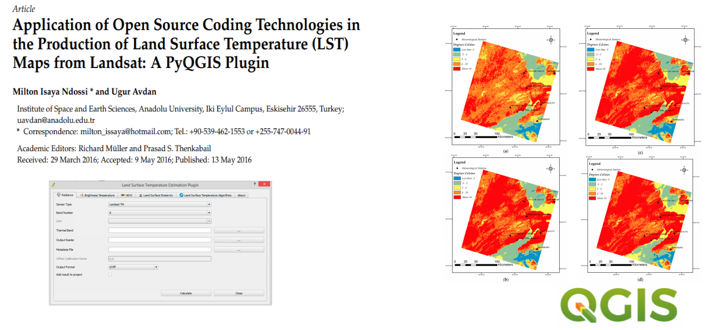
```

##### _Mas información_ [Paper aquí 👇](https://www.mdpi.com/2072-4292/8/5/413)
---
# Instalación de plugin
```{r, echo=FALSE,out.height=480,fig.align='center'}

```

---
# Mi primer proyecto en QGIS

```{r, echo=FALSE, out.height=480}
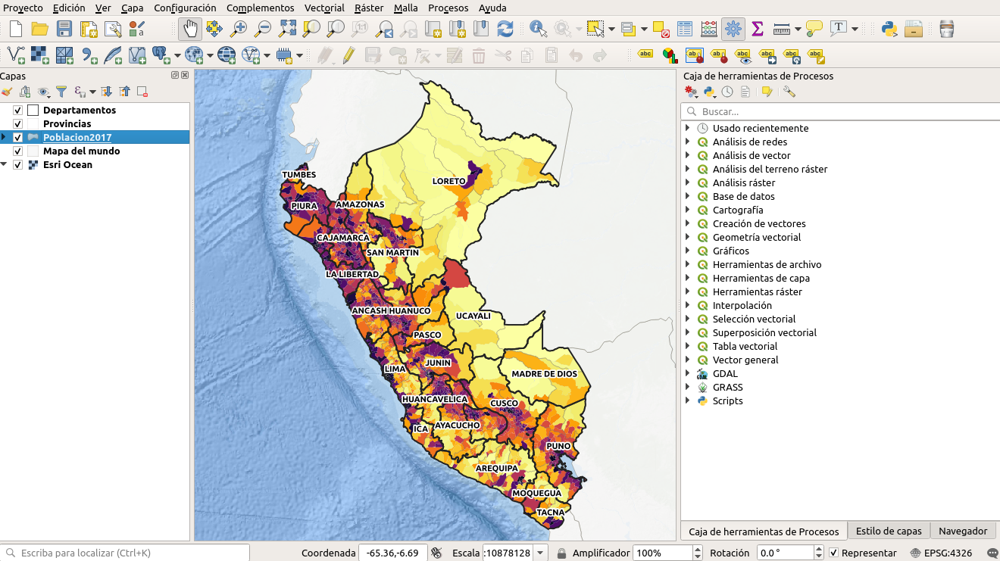
```

##### _Insumos_ [click aquí](https://github.com/barja8/OsgeoLiveUNMSM/raw/master/Sesi%C3%B3n01/Insumos/MapaBase.tar)
---
background-color:cover
class:center
# GRACIAS!
<div>
 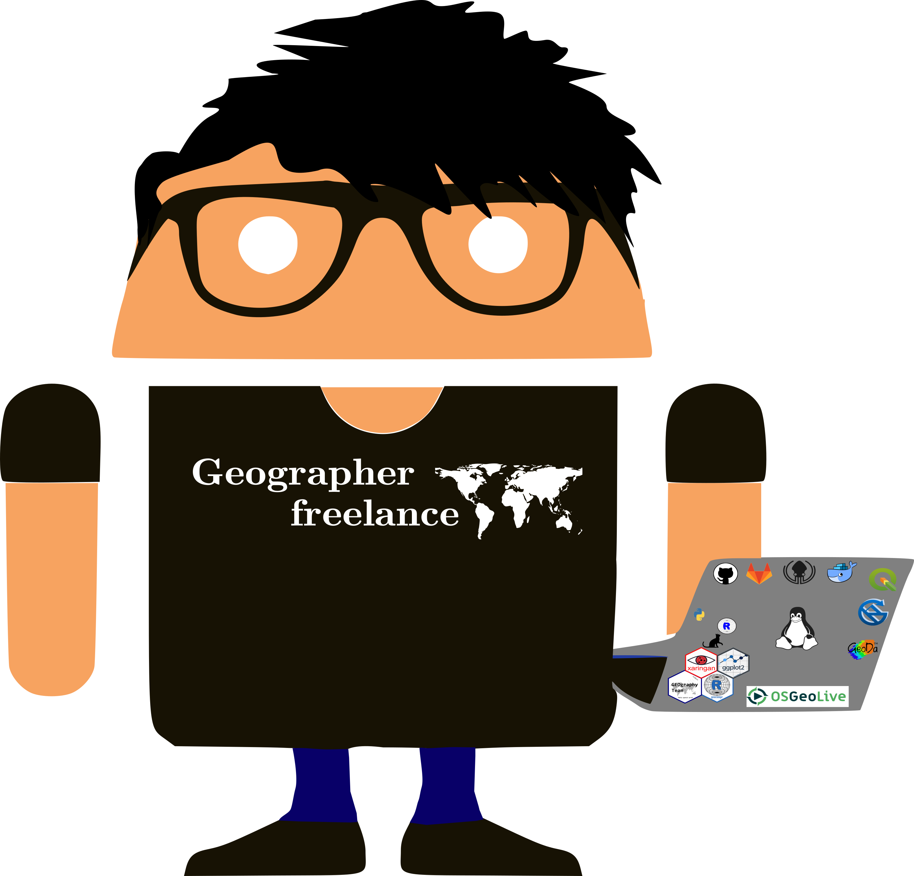
<br/>
<br/>
<div>
 
<a href="https://github.com/barja8" >barja8.github</a>
 </div>

<div>
 
 <a href="https://twitter.com/AntonyBarja1">Antony.Barja</a>
 </div>

<div>
 
 <a href=mailto:"antony.barja8@gmail.com">antony.barja8</a>
 </div>

**Slides created via the R package** [**xaringan**](https://github.com/yihui/xaringan)

