```{r setup, include=FALSE}
options(htmltools.dir.version = FALSE)
```


background-size: cover
class: center, middle, inverse
# Geographical data mining

---
# Minería de datos geográficos:La nueva moneda
.pull-left[
Según **Openshaw**, profesor de Centro de Geografía Computacional de la Universidad Leeds en Reino Unido,este término hace referencia a **la inmensa explosión en los datos geográficos** ocasionados por el desarrollo en la tecnología informática, sensores remotos, Mapeo digital y la difusión global del SIG.

```{r,echo=FALSE}
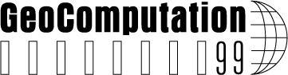
```

<br>
##### _Paper de Openshaw_ [aquí](http://www.geocomputation.org/1999/051/gc_051.htm)
]

.pull-right[

```{r,echo=FALSE,out.width=340,out.height=470,fig.align='right'}
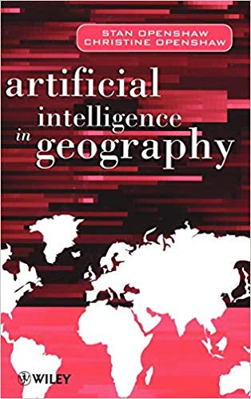
```

]
---
# Entonces:
## Geographycal Data Mining hace referencia:
--
<br>
* Al inmenso volumen de datos georreferenciados que se van generando de manera continua, y que hoy en día en su mayoria estan disponibles en fuentes abiertas dentro de mundo online de internet.
</br>
--
<br>
* En esta nueva geografía aparece un nuevo espacio de relación, el **entorno digital**, al que denominamos **cibergeografía** (**Fuenzalida, Buzai, Jiménez, y de León Loza, 2015**).
</br>
--
<br>
* No se trata de una nueva disciplina, sino de una evolución en lo que, quizás, sea el cambio más importante desde que Alexander Von Humboldt iniciará lo que se considera la geografía moderna (**Capel Sáez, 1981**).

---

background-size: cover
class: center, middle, inverse
# Fuentes de información geográfica abierta 

---
# Population Density Maps + Demographic
Posee información espacial de la demografía, población infantil y adulta a una resolución de 30m

```{r,echo=FALSE,fig.align='center',  out.height=430,out.width=950}
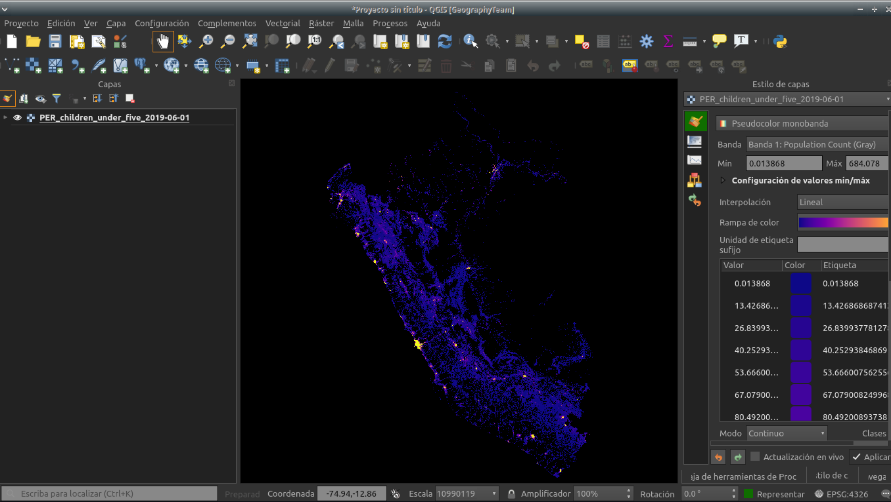
```

##### _Link de los datset_ [aquí](https://data.humdata.org/dataset/peru-high-resolution-population-density-maps-demographic-estimates)

---
# WorldPop
Posee información espacial y temporal de la demografía a una resolución de 100m

```{r,echo=FALSE,fig.align='center',  out.height=410,out.width=950}
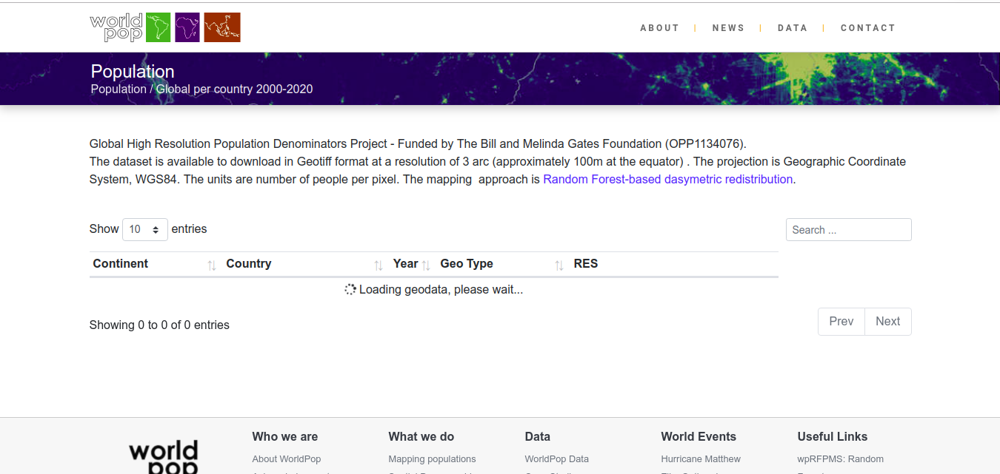
```

##### _Link de WorldPop_ [aquí](https://www.worldpop.org/geodata/listing?id=29)

---
# SRTM
Modelos de elevación digital de terreno de 30 m  

```{r,echo=FALSE,fig.align='center',out.height=410,out.width=950}
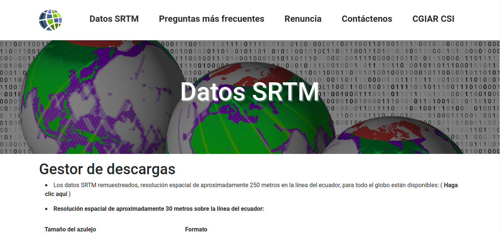
```

##### _Link de SRTM_ [aquí](http://srtm.csi.cgiar.org/srtmdata/)

---
# Jaxa DEM
Modelos digitales de superficie de 30 m 

```{r,echo=FALSE,fig.align='center',out.height=410,out.width=950}
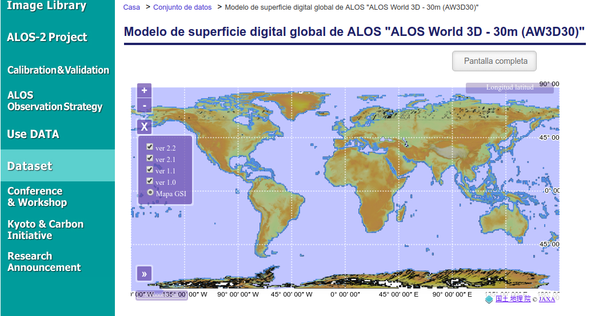
```

##### _Link de Jaxa DEM_ [aquí](https://www.eorc.jaxa.jp/ALOS/en/aw3d30/index.htm)

---
# Google Earht Engine 
Posee diferentes base de datos de imágenes satelitales entre las más inportantes destaca la serie de Landsat, MODIS y Sentinel.

```{r,echo=FALSE,fig.align='center', out.height=410,out.width=950}
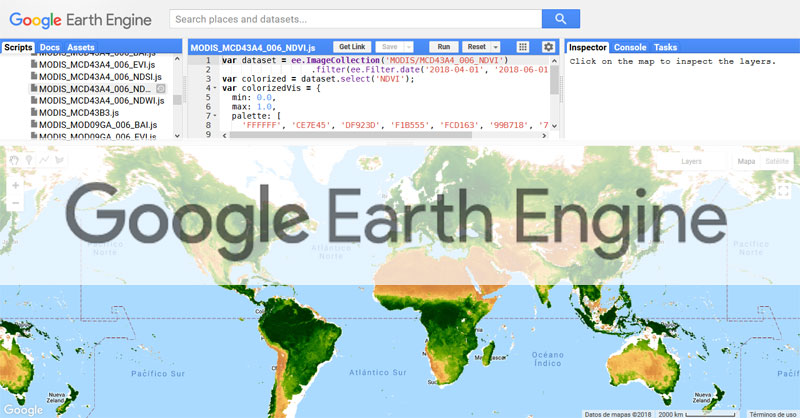
```

##### _Link de GEE_ [aquí](https://code.earthengine.google.com/afb96dd57557f0c2b56693fdd15f8309)

---
# Map the malaria atlas project
Posee información sobre el tiempo de viaje que tarda una persona en trasladarce a una ciudad más cercana.
```{r,echo=FALSE,fig.align='center', out.height=410,out.width=950}
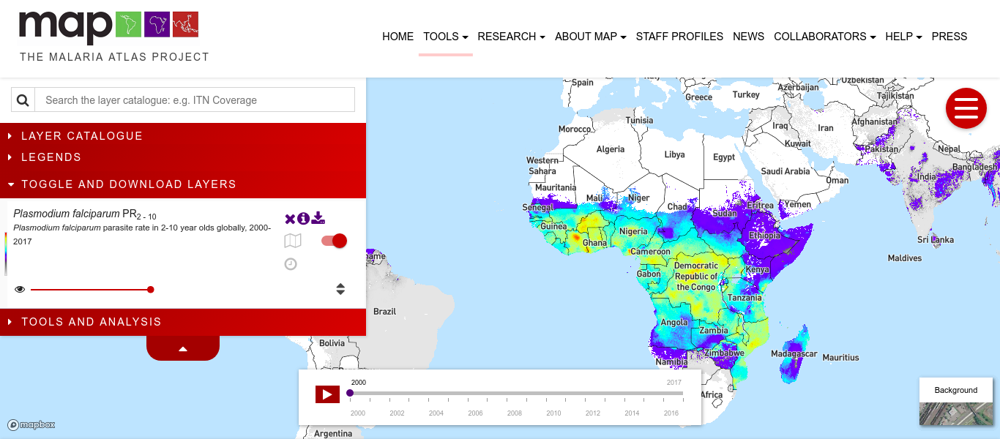
```

##### _Link de Map the malaria atlas project_ [aquí](https://map.ox.ac.uk/trends/country)

---
# Worldclim
Datos de variables climáticas como la Pp, T y otras variables bioclimáticas 

```{r,echo=FALSE,fig.align='center', out.height=410,out.width=950}
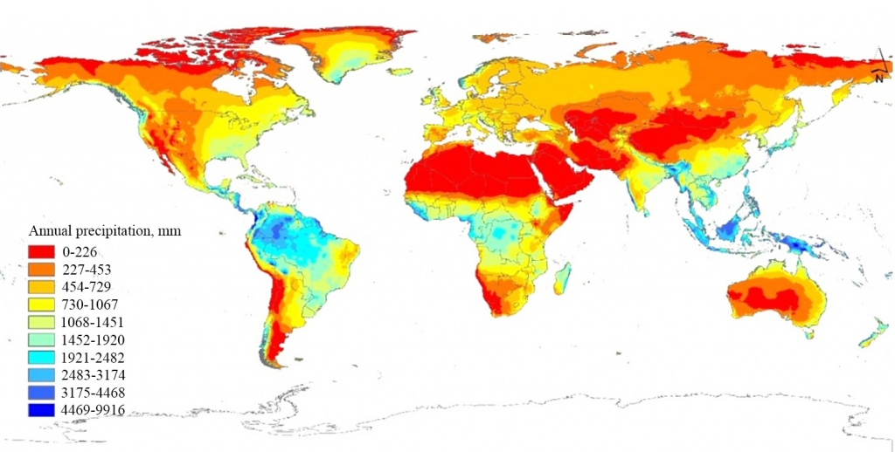
```

##### _Link de worldclim_ [aquí](https://www.worldclim.org/)

---
# PISCOp

```{r,echo=FALSE,fig.align='center', out.height=410,out.width=950}
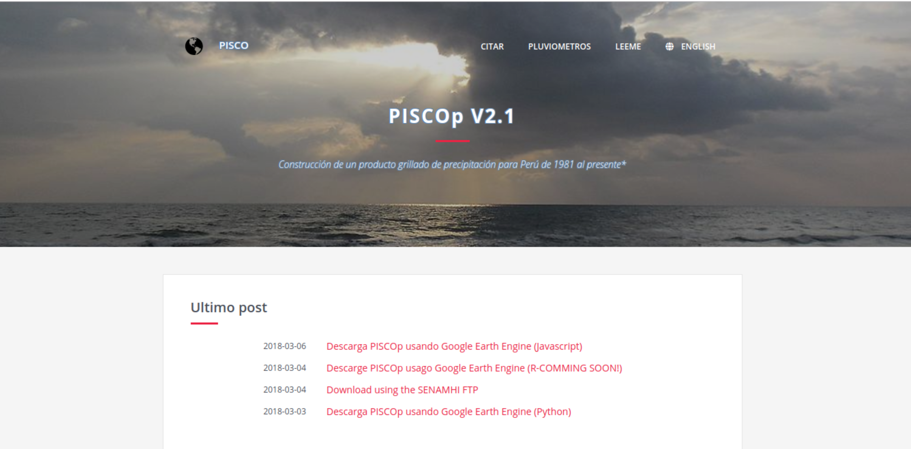
```
##### _Link de datos PISCOp V2.1_ [aquí](https://piscoprec.github.io/webPISCO/spa/)
---
# SoilGRID
Contiene información sobre el tipo de suelo y la taxonomía del suelo 
```{r,echo=FALSE,fig.align='center', out.height=410,out.width=950}
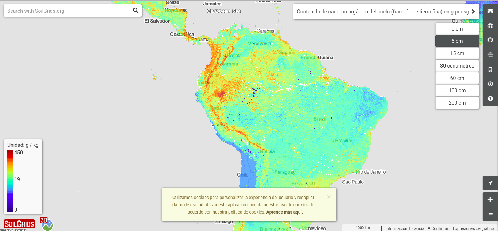
```

##### _Link de SoildGRID_ [aquí](https://soilgrids.org/#!/?layer=ORCDRC_M_sl2_250m&vector=1)
---
# OpenLandMap
Contiene información de diferentes tipos de cubiertas de la superficie terrestre como NDVI, TWI, litología, Pendiente, etc.

```{r,echo=FALSE,fig.align='center', out.height=410,out.width=950}
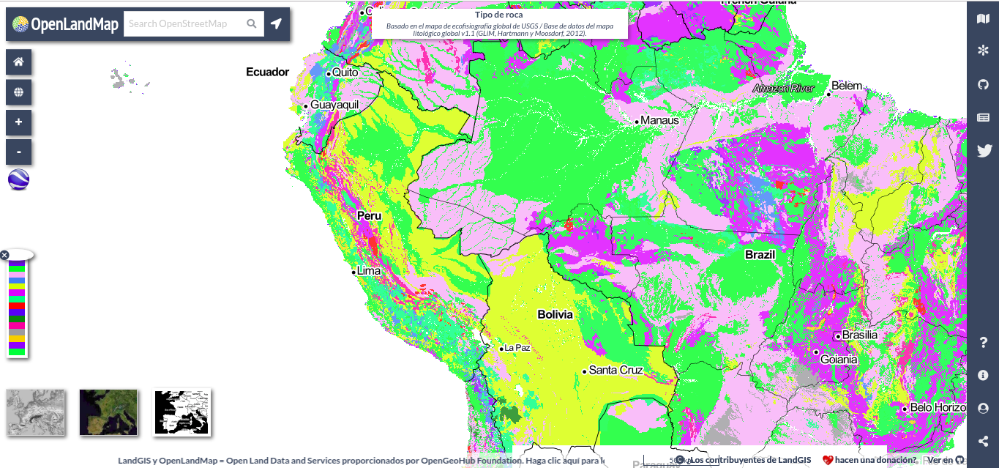
```

##### _Link de OpenLandMap_ [aquí](https://openlandmap.org)
---
# OSM
Contiene información vectorial de libre acceso 

```{r,echo=FALSE,fig.align='center', out.height=410,out.width=950}
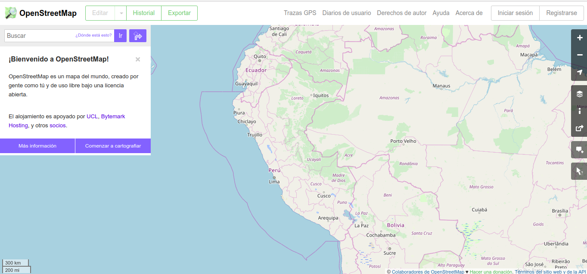
```

##### _Link de OSM_ [aquí](https://www.openstreetmap.org/#map=5/-9.297/-75.015)
---
# OSM Landuse/Landcover
Base de datos de OSM que contiene información sobre el uso del suelo a nivel global. Actualmente sigue en desarrollo y posee un total de 13 clases de entre ellas destacan zonas urbanas,zonas industriales, comerciales y de transporte,cultivos permanentes, etc

```{r,echo=FALSE,fig.align='center', out.height=390,out.width=950}
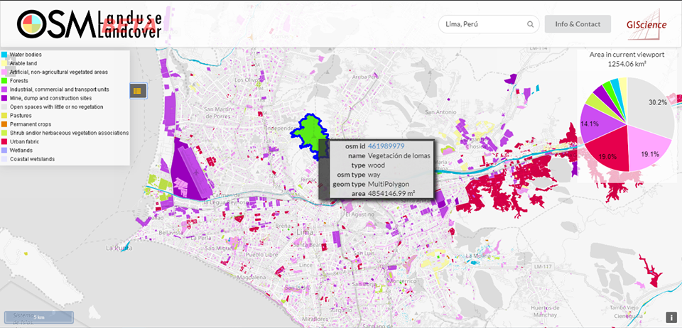
```

##### _Link de OSM Landuse/Landcover_ [aquí](https://osmlanduse.org/?fbclid=IwAR3YsM4Q6a9VGZiO11P4SLM_qS2-JlKmt0TEnhfX1g6S2sfYiHOnV5fnKMk#12/-77.03643/-12.0107/0/)

---
background-size: cover
class: center, middle, inverse
# Práctica
---
# Descargar modelos de elevación digital desde QGIS

```{r,echo=FALSE,fig.align='center', out.height=500,out.width=970}
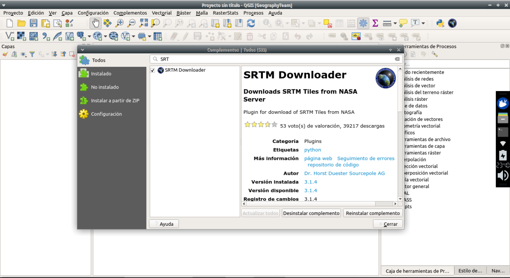
```

---
# Descargar datos de poblacion desde QGIS

```{r,echo=FALSE,fig.align='center', out.height=500,out.width=970}
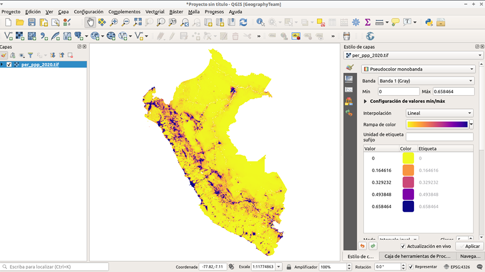
```
---
# Descargar datos de OSM

```{r,echo=FALSE,fig.align='center', out.height=500,out.width=970}
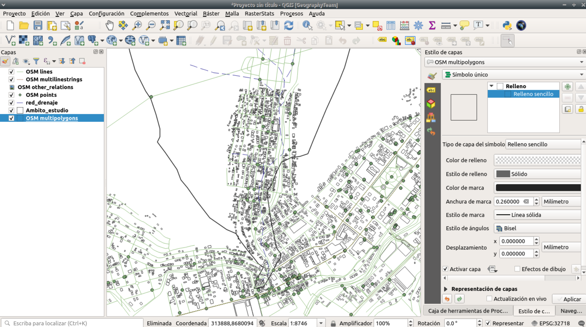
```

---
# Descargar datos de sentinel 2

```{r,echo=FALSE,fig.align='center', out.height=500,out.width=970}
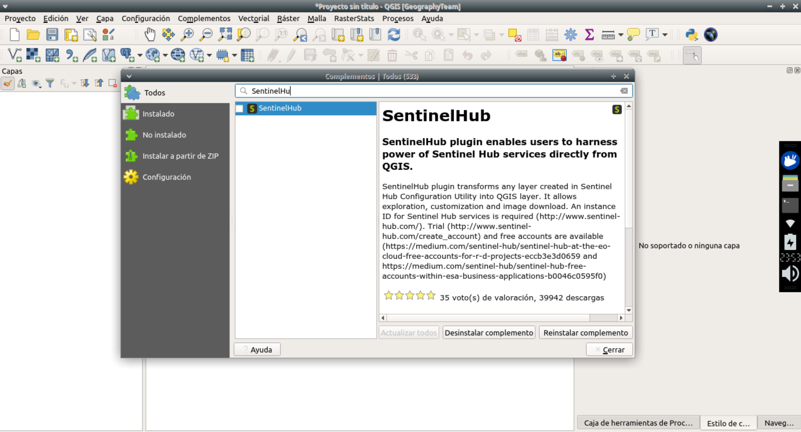
```

---
# Descargar datos de sp

```{r,echo=FALSE,fig.align='center', out.height=500,out.width=970}
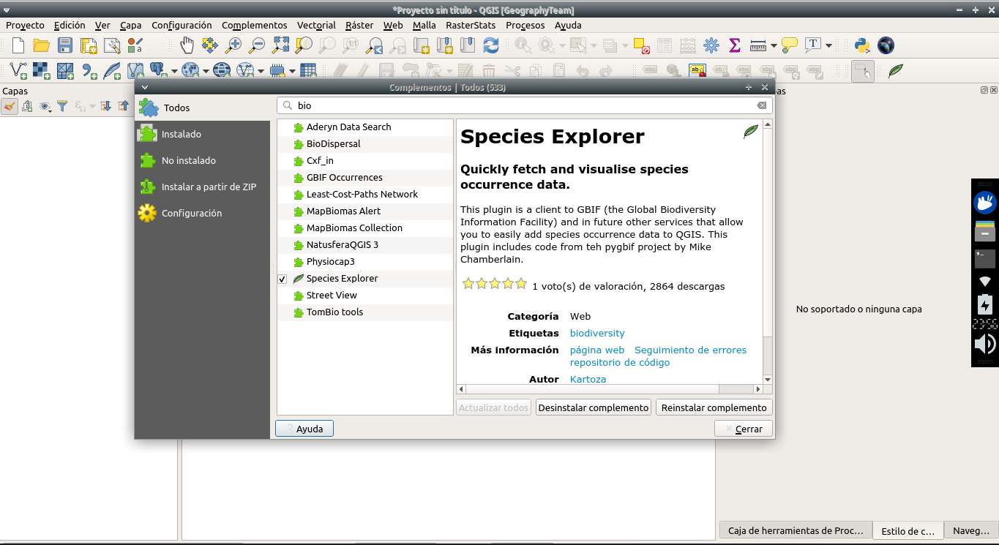
```
---
# Descargar datos de flora y fauna

```{r,echo=FALSE,fig.align='center', out.height=500,out.width=970}
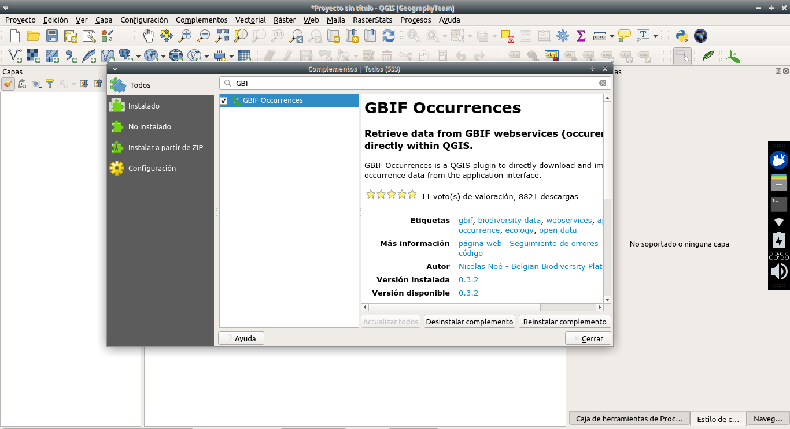
```
---
# Descargar datos de Landsat, Sentinel,Modis y ASTER

```{r,echo=FALSE,fig.align='center', out.height=500,out.width=970}
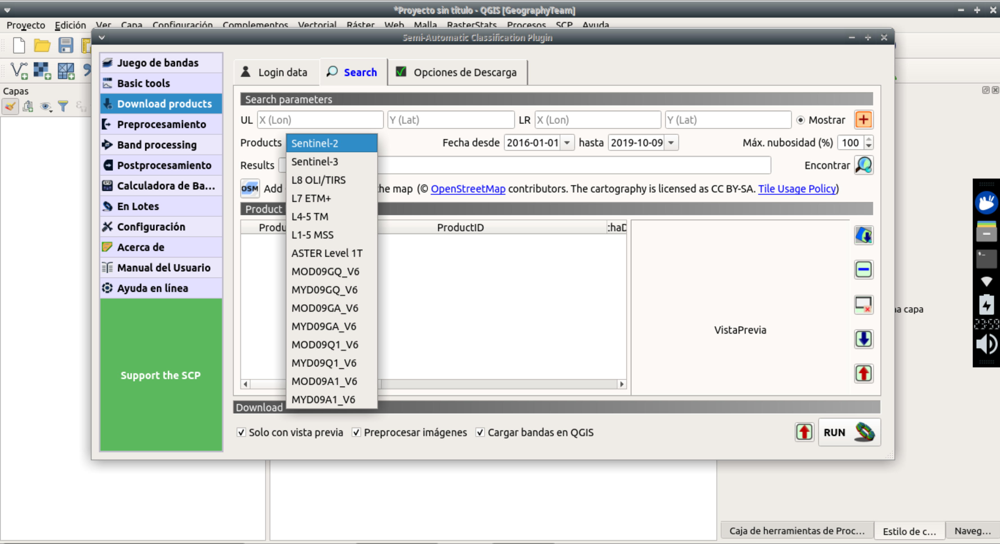
```

---
# Descargar datos de OpenEO

```{r,echo=FALSE,fig.align='center', out.height=500,out.width=970}
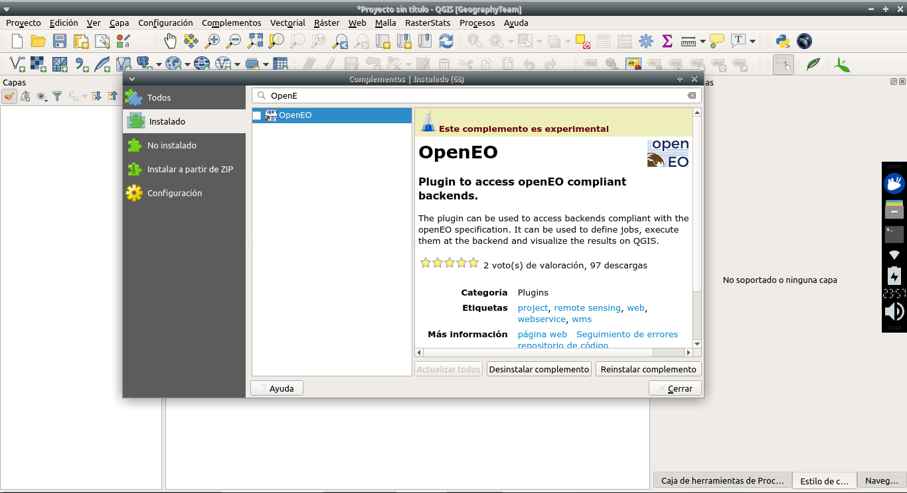
```

---
# Geprocesamiento de datos vectoriales
  
```{r,echo=FALSE,fig.align='center', out.height=500,out.width=970}
knitr::include_graphics("img/volcan_ubinas01.png")
```

---

# Geoprocesamiento de datos raster

```{r,echo=FALSE,fig.align='center', out.height=500,out.width=970}
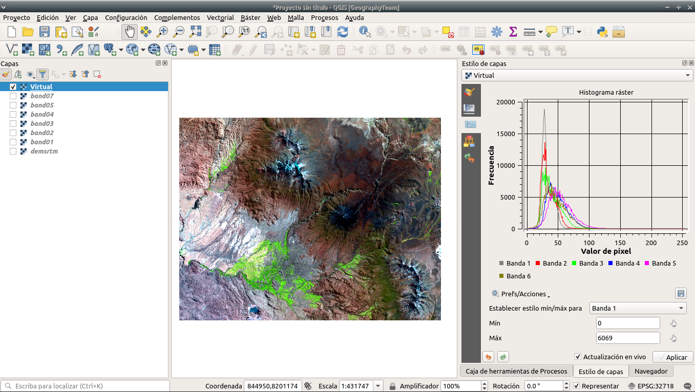
```

---
# Visualización en 3D

```{r,echo=FALSE,fig.align='center', out.height=500,out.width=970}
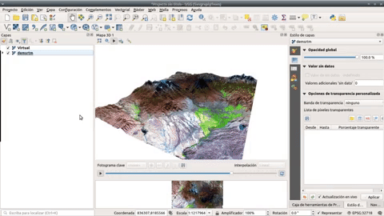
``` 
---
background-color:cover
class:center
# GRACIAS!
<div>
 
<br/>
<br/>
<div>
 
<a href="https://github.com/barja8" >barja8.github</a>
 </div>

<div>
 
 <a href="https://twitter.com/AntonyBarja1">Antony.Barja</a>
 </div>

<div>
 
 <a href=mailto:"antony.barja8@gmail.com">antony.barja8</a>
 </div>

**Slides created via the R package** [**xaringan**](https://github.com/yihui/xaringan)

